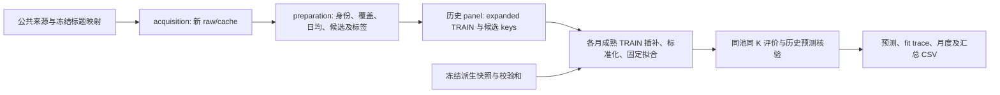

# WikiFlow 设计文档：月度维护检查榜单

状态：2026-10-05 对已实现、已审计基准的说明。面向 ML in Practice 课程队友，定义以本仓库源码、冻结配置和验证记录为准。本次新增文档不修改数据、模型或已报结果。

## 1. 用途、范围和非目标

设编辑者每月可检查 K 篇文章。WikiFlow 从维护名单中找出当前未升温、最近两完整月大幅编辑较少、下月可能出现内部导航升温的文章，提供一个待人工检查的排序。Binary 关注是否发生事件；relative continuous 关注超过事件门槛的相对幅度。编辑者仍需阅读文章并判断更新需求；流量升温和少量编辑不是内容过时、质量低或必须维护的真实标签。

固定 scope 是 WikiProject Artificial Intelligence 维护名单的 **1,187 个 canonical article**，包括人物、作品等，不是纯 AI 技术集合。当前仓库交付离线采集、清洗、筛选、训练和评价 pipeline，输出预测与 CSV；没有实现上线榜单 UI、自动编辑或实际编辑收益评估。

本设计只覆盖身份修正后的 binary 和最新 relative continuous 主线。旧 absolute continuous、跨分支诊断融合和正在进行的新渠道/来源特征实验不参与此处的训练、结果或比较。新渠道实验属于**进行中的扩展，尚未完成和纳入本包**。

## 2. 数据流与可追溯边界



|输入|测量/公共来源|本基准使用范围与处理|
|---|---|---|
|维护名单及 redirects|当前 WikiProject talk category，经 MediaWiki 标题规范化和 redirects 解析|冻结 [title mapping](../data/title_mapping.csv) 与 [维护名单](../data/wikiproject_ai_articles.csv)，回溯应用当前名单|
|月度 Clickstream，简称 CS|[Wikimedia monthly dumps](https://dumps.wikimedia.org/other/clickstream/readme.html) 的字面四列 TSV|2022-09—2026-08；只保留 `type=link`、destination 在 canonical 名单内的公布边；来源可为名单外文章，按目的文章求和|
|日级 PV|[Article pageviews API](https://doc.wikimedia.org/generated-data-platform/aqs/analytics-api/reference/page-views.html)，`en.wikipedia.org/all-access/user/daily`|特征截至自身当前月最后一天，最终截止 2026-07-31；显式 0 有效，缺日期未知|
|编辑历史|[MediaWiki revisions API](https://www.mediawiki.org/wiki/API:Revisions) 的 revision/parent ID、timestamp、size、minor、SHA 与覆盖区间|候选使用两完整月及窗口前 parent 状态；打包获取入口默认 2023-08-01 至 2026-08-01 exclusive；不请求编辑者、正文或评论|

CS 是内部有链接导航的公布次数，**不是独立用户数**，也不是全部 PV、搜索曝光或外部流量。低计数边受抑制，文章/月没有公布记录不能解释为零。解析器要求已公布 `count>=10`，保留字面 `count=10` 的边界；这是冻结数据的解析合同，不宣称各历史 release 都采用同一抑制边界。[官方格式说明](https://meta.wikimedia.org/wiki/Research:Wikipedia_clickstream) 也记录过发布方式变化。

redirect/normalized mapping 用于确定 canonical 维护名单；本包没有把所有 alias destination 再自行聚合到 canonical，不以新聚合定义替换历史结果。每个来源和派生输入的 SHA256 在 [provenance](../data/provenance.json)，公共 dump 记录在 [download provenance](../data/public_download_provenance.json)。

对目标月 M，当前完整月 c=M−1。特征和资格只使用截至 c 的资料；标签使用目标 M 的公布 CS。训练假设 target<M 的已知标签在 M 月初已成熟，**真实历史发布时延未核实**。当前 2026 名单、标题映射及修订数据 vintage 回溯应用于历史；因此回测没有证明月初可直接生产部署，也不代表当时能取得完全相同的 scope 和数据版本。

## 3. 身份与缺失合同

每行主键为 `target_month:pageid`，同时保存 canonical `article`、`cutoff_month` 和 `max_feature_date_declared`。时间、身份和标签须一起验证，不能只靠同名标题连接。

[身份策略](../config/identity_policy.json) 对应权威 `identity_correction_v1_Daniel_homonym_quarantine`：Daniel Kokotajlo 当前同名槽 pageid **79745475** 在 TRAIN、候选、标签中统一阻断；不把导演 pageid **62422990** 的历史转移给它，也不以零标签填补。历史排除 **1164/72417803** 保留；Naevis **78522383** 为 review-only，仍保留。该修复没有为其他所有文章签发历史身份认证，特别是季节标题槽仍可能存在变化。

缺失处理按用途分开：

- CS 历史不足、编辑覆盖/parent 不完整或隐去记录导致质量未知：该行不能形成合格 expanded pool；不制造零流量或零编辑。
- PV 月不完整：PV 值和趋势为 `None`，保留 missing flag；各折只用 TRAIN 中位数插补。
- 季节月缺失：用当前 CS 日均作特征 fallback，同时置 seasonal missing flag。
- 未来 actual 未知：`known=false`，event/R/gR 均为 `None`；不成为训练负例。评价保留既定候选，整月指标 NA，不删未知候选后 refill TopK。

## 4. 未升温与最近编辑候选规则

记文章在月 j 的公布 incoming count 为 I_j，月长为 D_j，日均 v_j=I_j/D_j。对结束于 c 的六个月 `c−5,…,c`：

```text
m = median(v_(c−5), …, v_c)
s = 1.4826 * median(|v_j − m|)       # robust daily sigma
U_M = max(200, D_M*m + max(100, 0.5*D_M*m, 3*D_M*s))
x_M = I_c * D_M / D_c              # 延续当前日均，投影到目标月总量
```

U 是固定历史异常边界，含 count 单位的 floor/padding，不是已校准的概率置信区间。当前未升温需要同时满足 `v_c <= U_M/D_M` 和 `I_c <= U_c_precurrent`；后者用 `c−6,…,c−1` 的六个月日均、月长 D_c 代入同一 U 公式，**不含当前月**。

候选还要求身份允许、`I_c>=100`、`c−6,…,c` 七个月均有公布记录、元数据质量完整。编辑窗口为 `[M−2 月初, M 月初)` 的两完整月 UTC；每次非 minor 编辑以 revision size 减真实 parent size 得到净字节变化，并取绝对值：

```text
max(abs(nonminor net byte delta)) < 500
sum(abs(nonminor net byte delta)) < 1000
```

等于 500 或 1000 即不合格；minor 忽略，回退照计。完整覆盖且没有非 minor 编辑可得到 0；覆盖未知不能补 0。净字节变化可能漏掉同等字节删除/新增的大幅改写，因此它仅是编辑活动代理。

**训练不加这两条编辑量阈值。** `build_panel` 先产生质量完整、current-cold 的 expanded pool，再由 `candidate_allowed` 标记评价资格；每折从 expanded pool 选成熟已知标签训练。冻结 expanded pool 为 **11,080 行**，开发评价候选为 **5,388 article-month**。

## 5. Binary 与 relative continuous ground truth

每篇文章的目标月阈值由当时历史决定：

```text
T_M = max(U_M, 1.25*x_M)
y_M = 1[actual_M > T_M]             # 严格 >，未知保持未知
R_M = max(0, actual_M/T_M − 1)
gR_M = log1p(R_M)                  # 自然对数，压缩一次
```

Binary 同时要求超过历史异常 U 且日均环比严格超过 25%；不是预测未来是否有任意流量增加。Relative R 是超过同一 T 的相对量，量纲为 1；Ridge/HGB regressor 训练响应及 relative DCG gain 均为 gR。旧 absolute `max(0,actual_M−T_M)` 按 count 计幅度，**不是本包 continuous GT**。

例：c 有 30 天，M 有 31 天，最近六个月日均均为 100，`I_c=3000`。此时 m=100、s=0、x=3100、U=T=4650。若 actual=6975，则 y=1、R=0.5、gR=log(1.5)≈0.405465；若 actual=4650，则 y=0、R=gR=0。若 actual 未知，这三者均未知。该例展示月长换算与严格门槛；在其他历史中 `1.25*x` 也可能主导 T。

浮点复现保留历史乘法顺序：标签字段 `effective_event_U_asof` 使用 `max(U,1.25*I_c*D_M/D_c)`；Log13 的追加 margin 经 `joint_threshold` 先算 `I_c*D_M/D_c` 再乘 1.25。数学相同，舍入可能略异；核验不允许以数值容限掩盖标签或身份改变。

## 6. 原 13 个特征及预处理

以下序号从 1 开始，括号为 Python 数组 index。冻结快照 `features` 存前 12 列；`preparation.FEATURES` 定义名称。**只有 Log13** 在 `preprocess(append_joint=True)` 时追加第 13 列，其他三个学习器使用 12 列。所有 `log1p` 均为自然对数，不把月总量与日均互换。

|序号|代码字段/表达式|历史窗口与原始单位|
|---:|---|---|
|1 (0)|`log_current_daily_rate` = log1p(v_c)|当前完整月 c；原量 incoming 次/日，变换后对数值|
|2 (1)|`log_previous_daily_rate` = log1p(v_(c−1))|前一完整月；incoming 次/日的对数值|
|3 (2)|`log_mean_last3_daily_rate`|c−2…c 三个月日均的算术均值再 log1p；每月等权，不把三月总量除以总天数|
|4 (3)|`log_median_last6_daily_rate`|c−5…c 六个月 CS 日均中位数再 log1p|
|5 (4)|`last6_daily_rate_slope` = Σ(i−2.5)v_i / 17.5，i=0…5|c−5…c 按月顺序的 OLS slope；incoming 次/日/月份步长；没有 log 变换|
|6 (5)|`log_seasonal_daily_rate`|**目标 M−12** 的日均再 log1p；缺失用 v_c fallback，不是 c−12|
|7 (6)|`seasonal_missing`|季节月缺失为 1，否则 0；无量纲|
|8 (7)|`log_current_month_mean_daily_PV`|c 全部日期均有记录时，整月 PV 算术日均再 log1p；原量 views/日，否则 None|
|9 (8)|`last14_prior14_log_PV_growth`|以 c 最后一天结尾的最近 14 天、此前 14 天：log1p(近期日均 PV)−log1p(前期日均 PV)；无量纲；整月不完整则 None|
|10 (9)|`PV_month_missing`|当前整月 PV 不完整为 1，否则 0；无量纲|
|11 (10)|`log_robust_daily_rate_sigma` = log1p(s)|c−5…c 六个月日均的 MAD×1.4826；原量 incoming 次/日|
|12 (11)|`log_daily_persistence_margin_U` = log1p(x_M)−log1p(U_M)|目标月 count 投影相对历史边界的 log margin；无量纲|
|13 (追加)|joint-T margin = log1p(x_M)−log1p(T_M)|同一当前月及六个月历史；无量纲，只追加到 Log13|

每个 M 的成熟 TRAIN 独立计算每列 observed median、插补后的 mean 和**总体标准差**。整列未观测 median=0 是计算 fallback，仍保留 missing flag；std<1e−12 使用 1。候选只能使用 TRAIN 的这些值，不能反向参与估计。线性和树模型均使用该标准化输入，保持历史配方。特征不含目标月 CS/PV、未来编辑、event 或 R。

## 7. 排序方法、超参数与选择来源

所有规则只读 as-of 特征。记 `q=v_c / v_(c−1)`；七个月公布合同保证前月正值。PV trend h 为第 9 列，`PVforecast=x_M*exp(h)`；当前整月 PV 不完整时回退 x_M。这是固定规则预测，不是拟合 PV 模型。

|类别 / package method|用于排序的分数|适用比较|
|---|---|---|
|Naive `volume`|I_c|binary / relative|
|Strong CS `strong_cs`|log1p(x_M)−log1p(T_M)|binary / relative；按距联合门槛排序|
|CS momentum `cs_momentum`|log1p(v_c*q*D_M)−log1p(T_M)|binary / relative|
|Clipped momentum `cs_momentum_clipped`|上式 q 固定 clip 到 [0.5,2]|仅 relative 主方法表|
|PV against U `pv_u`|log1p(PVforecast)−log1p(U_M)|binary / relative|
|PV against T `pv_t`|log1p(PVforecast)−log1p(T_M)|binary / relative；表中的 PV trend/T|
|Simple linear `binary_log13`|13 列 Logistic 的预测事件概率|binary，mean BCE + 0.5×0.01×‖β‖²，截距不惩罚|
|Simple linear `relative_ridge12`|12 列对 gR 的回归预测|relative，mean squared error + 0.01×‖β‖²；sklearn alpha=N×0.01，cholesky，有截距|
|Nonlinear `binary_hgb12`|12 列 HistGradientBoostingClassifier 事件概率|binary，log_loss|
|Nonlinear `relative_hgb12`|12 列 HistGradientBoostingRegressor 对 gR 的预测|relative，squared_error|

回归输出用于排序，没有在评价前再次取 log、指数还原或截断负预测。Log13 为自实现 damped Newton：零 slopes、TRAIN prevalence logit 截距初始化；gradient infinity norm≤1e−9，最多 200 轮、60 次线搜索，Armijo=1e−4。无类别或月份权重，无 warm start、重试或校准。

两个 HGB 均为 30 轮、learning_rate=.03、depth=2、leaves=4、bins=32、L2=1、max_features=1；`min_samples_leaf=max(50,ceil(0.1*ownTRAIN_N))`，seed=718。无类别权重、类别特征、early stopping、内部 validation fraction 或 warm start。每个月重新拟合。目录历史名称 HGB26/authorized26 指身份修复的 26 次拟合，**不代表 26 列特征**。

超参数来源和模型构思的边界须分开：

|选择|可核实历史|解释|
|---|---|---|
|Binary 数值配方|F1 TRAIN=2023-10—12、INNER评价=2024-01—04；F2 TRAIN 截至 2024-04、INNER评价=2024-05—08；TRAIN N/P 分别 649/40、1590/71|比较 Log12 λ=.1/.01、HGB stump/depth2。8 个 INNER 月等权 NDCG50 选 Log12 .01（.155725）；HGB depth2（.110317）保留作比较，不是赢家|
|后来 Binary Log13/规则叙事|继承数值参数，joint-T 列和后续诊断看过历史开发结果|不能声称所有 feature/模型/规则选择只接触早期未见历史|
|Relative Ridge λ|[冻结选择](../config/early_selection.json)：2024-02/05/08 三个早期 expanding 历史折，仅比较 .01/.1|等月 graded NDCG50 均值 .210700/.193604，选 .01；差≤1e−12 选较强正则 .1；HGB 固定，没有树网格搜索|
|身份修复和打包验证|保持 [benchmark 配置](../config/benchmark.json)|没有重新调参；本包提供冻结选择记录及选择函数/测试，没有重跑原参数搜索|

## 8. 时间划分与运行合同

历史模型行 target 为 2023-10—2026-08，开发评价 target 为 **2024-09—2026-08 的 24 月**。每个 M：

1. 从 expanded pool 选 `target_month<M` 且 label known 的 TRAIN；每个训练行的特征≤它自身 target−1。
2. 用该 TRAIN 拟合插补/scaler 和固定模型；候选特征与编辑资格截至 c=M−1。
3. 冻结 M 的分数，之后才用目标月自然标签计算排名指标。
4. 下一月扩大历史 TRAIN，重新计算预处理、重新拟合；不从 M 的结果改变参数。

早期 INNER/λ 选择月份、后来已见开发回测、未来独立测试是不同角色。现有 split 曾叫 validation/dev 不恢复独立性：这些历史月份已反复研究，**全部已报分数为开发回测**。**2026-09 holdout 封存，未读、未训练、未评价**；打包入口拒绝该月及之后。前月已成熟的操作假设和实际发布延迟问题仍需在任何上线评估前解决。

## 9. 同池评价、macro/micro 与 gain

每个方法对同一月份全部候选给出有限分数，用 score 降序、当前 count 降序、pageid 升序的固定 tie order。K 固定为 **5/10/20/50/100/200**，actual_K=min(K,N)。不会按预测方法改变候选、丢未知标签或补齐新候选。

```text
DCG@K = sum(gain_i / log2(i+1), i=1…actual_K)
NDCG@K = DCG@K / ideal_DCG@K
binary gain = event
relative gain = gR                  # identity gain，只有标签处的一次 log1p
```

Relative gain 不再 log，也不用 `2^gain−1`。AP 是整个 candidate ranking 的 rank-tiebroken average precision，**不是 AP@50**；改变 K 不改变 AP。TP@K、precision、recall 按 binary event 计算，relative 表也保留这些辅助结果。

macro 是各有效月等权均值：NDCG/AP/recall 的零事件月为 NA，precision/TP 为 0。任一未来候选 label unknown 则整月指标 NA。micro precision=累计 TP/累计有效 slots，micro recall=累计 TP/累计有效 events；pooled gR capture=累计 TopK gR/累计全池 gR。它们不等于一般的 macro 月均，不能混称。

规则先独立重构公式，与原分数最大差≤1e−12 后保留历史 canonical floats，以还原浮点近似 tie；此处理已记录在验证报告。四个学习器分数均来自实际重训，不以存储预测代替拟合。

## 10. 已复现结果与局限

共同支持为 5,388 article-month、24 月、23 个标签全部已知月、22 个含事件月、182 events；K50 有 1,150 有效 slots。2026-04 有未知标签，整月 NA；2025-04 无事件，NDCG/AP/recall NA，但 TP/precision 计入。2026-07 在隔离未知身份后恢复完整评价。

|Binary K50|macro NDCG|macro AP（完整列表）|累计 TP|
|---|---:|---:|---:|
|volume|0.123384165982|0.062143794623|45|
|strong CS|0.262764324285|0.133360599203|70|
|Log13|0.261323643627|0.127705211410|75|
|HGB12|0.254520450786|0.114735066542|77|

|Relative K50|macro graded NDCG|
|---|---:|
|volume|0.092810605545|
|Ridge12|0.138377139655|
|HGB12|0.127657749963|
|PV trend/T|0.184767834660|

[完整主方法表](../results/summary_at50.csv) 包括 binary 7 / relative 8 方法，[逐月表](../results/monthly_at50.csv) 保留支持差异。不能据这些点均值声称稳定 ML 胜过强 CS/PV 规则、独立测试优势或真实维护收益。

既有打包验证执行了冻结快照 96 次、已有 raw cache→清洗→重训 96 次，合计 **192 次固定拟合**，没有新搜索。两条路径的 96 个模型/月完整排序各自全部相同；缓存路径模型分数最大误差≤9.72e−16，6,480 个月度 NDCG/AP/TP 字段最大误差≤5.56e−17。证据为 [cache refit](../results/verification.json)、[snapshot refit](../results/snapshot_refit_verification.json)、[cache preparation](../results/cached_preparation_verification.json)、[fit accounting](../results/fit_accounting.json)。纯文档追加不重新执行这些 benchmark fits。

限制包括：非纯 AI scope、当前名单/标题和 revised vintage 回溯、CS 抑制及非独立用户、历史身份认证不完整、真实 release latency 未核实、编辑净字节代理、重复开发选择、缺真实维护标签。全量 fresh 联网下载、bootstrap 重估、封存 September 独立测试、上线及编辑者效益验证都**尚未完成**。新渠道/来源特征尚在实验，不纳入这里的证据。

## 11. 复现命令和代码入口

从仓库根目录运行，建议 Python 3.13.5，依赖版本固定在 [requirements](../requirements.txt)。seed=718，线程=2。默认离线使用约 2MB 的派生 `panel.json.gz`；raw 大数据、完整 sessions、机器路径和编辑者信息不入仓库。

```bash
python3 -m venv .venv
. .venv/bin/activate
python -m pip install -r wikiflow/requirements.txt
export PYTHONPATH=wikiflow/src
export OMP_NUM_THREADS=2 OPENBLAS_NUM_THREADS=2 MKL_NUM_THREADS=2 VECLIB_MAXIMUM_THREADS=2
python -m unittest discover -s wikiflow/tests -v
python -m wikiflow.reproduce --mode refit --output wikiflow/runs/my-refit
```

`refit` 是 24×4=96 次固定拟合；`--mode replay --output wikiflow/runs/my-replay` 只重算已存预测，0 次 benchmark 拟合。每次使用新目录，记录实际拟合数、TRAIN hashes、预处理、分数、排序、指标和容限；不一致超容限即停止。复现本设计所述验证不要求重新联网采集。

从公共来源重新获取或将现有 raw cache 接入同一入口，使用 [README 的下载与清洗命令](../README.md)。清洗输出可运行：

```bash
python -m wikiflow.reproduce --mode refit \
  --prepared-panel wikiflow/local_data/rebuilt_panel.json.gz \
  --output wikiflow/runs/my-cached-refit
```

新 raw 获取不会覆盖/删除旧缓存；当前 API/vintage 与冻结资料可能不同，因此未经 keys、身份、标签、资格及数值核验不能称精确复现。网络解析仅用公共合成 fixture 测试，未声称 fresh 下载已成功。

|入口|职责与重要函数|
|---|---|
|[acquisition.py](../src/wikiflow/acquisition.py)|公共 `topic/clickstream/pageviews/revisions` 命令；`historical` 拒绝封存月份，`fresh` 保留既有输出|
|[preparation.py](../src/wikiflow/preparation.py)|`article_features`、`metadata_activity`、`build_panel`；日均/月长、parent 净字节、缺失、expanded pool 与候选分离|
|[core.py](../src/wikiflow/core.py)|`historical_bound`、`make_label`、`candidate_allowed`、`select_training`、`preprocess`、`rank_metric`、`aggregate`、`select_lambda`|
|[learners.py](../src/wikiflow/learners.py)|`fit_logistic`、`model_parameters`、`fit_predict`；固定四家族配方|
|[reproduce.py](../src/wikiflow/reproduce.py)|`validate_panel`、`verify_prepared`、`baseline_scores`、`run`；快照 hashes、TRAIN keys、真实重训或 replay 及核验|
|[tests](../tests)|22 项既有离线测试：月长与严格边界、身份/未知、candidate、TRAIN scaler、gain 一次、macro/micro、早期选择和数值求导等|

进一步的审阅证据见 [audit](audit.md)。本设计是已实现基准的可复现说明，未完成内容需独立批准和验证后才能进入新版本结果。
