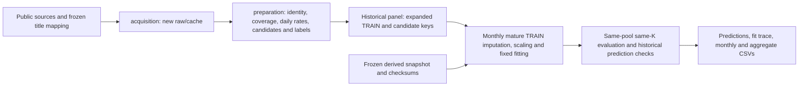

# WikiFlow design: monthly maintenance review ranking

Status: a description of the implemented and audited benchmark as of 2026-10-05. This document is for ML in Practice course teammates. Definitions follow the repository source, frozen configuration and verification records. Documentation changes do not alter data, models or reported results.

## 1. Use case, scope and non-goals

Assume an editor can inspect K articles each month. WikiFlow ranks articles in the maintenance portfolio that are currently cold, have had few substantial edits over the last two complete months, and may experience increased internal navigation next month. Binary predicts whether an event occurs; relative continuous ranks the relative magnitude above the event threshold. Editors must still read articles and judge their update needs. Increased traffic and few edits are not ground-truth labels for outdated content, poor quality or required maintenance.

The fixed scope is **1,187 canonical articles** in the WikiProject Artificial Intelligence maintenance portfolio, including people, works and other subjects. It is not a pure AI technology collection. The package implements offline acquisition, preparation, filtering, training and evaluation, producing predictions and CSVs. It does not implement a production ranking UI, automated article edits or measurement of actual editorial benefits.

This design covers only the identity-corrected binary benchmark and latest relative continuous benchmark. Old absolute continuous targets, cross-branch diagnostic fusion and ongoing channel/source-feature experiments do not enter its training, results or comparisons. New channel experiments are **in-progress extensions, unfinished and excluded from this package**.

## 2. Data flow and provenance boundaries



|Input|Measurement / public source|Benchmark range and handling|
|---|---|---|
|Maintenance portfolio and redirects|Current WikiProject talk category, resolved through MediaWiki title normalization and redirects|Frozen [title mapping](../data/title_mapping.csv) and [portfolio](../data/wikiproject_ai_articles.csv); current membership is applied retrospectively|
|Monthly Clickstream, abbreviated CS|Literal four-column TSV from [Wikimedia monthly dumps](https://dumps.wikimedia.org/other/clickstream/readme.html)|2022-09 through 2026-08; retain published `type=link` edges with destinations in the canonical portfolio and sum by destination; sources may be outside the portfolio|
|Daily PV|[Article pageviews API](https://doc.wikimedia.org/generated-data-platform/aqs/analytics-api/reference/page-views.html), `en.wikipedia.org/all-access/user/daily`|Features end on the last day of each row's current month; final cutoff 2026-07-31; explicit 0 is valid, absent dates are unknown|
|Edit history|[MediaWiki revisions API](https://www.mediawiki.org/wiki/API:Revisions): revision/parent IDs, timestamp, size, minor flag, SHA and coverage intervals|Candidates use two complete months and a pre-window parent state; the packaged acquisition entry point defaults to 2023-08-01 through 2026-08-01 exclusive; editor identities, text and comments are not requested|

CS measures published internal linked-navigation counts, **not unique users**, total PV, search exposure or external traffic. Low-count edges are suppressed; an absent article/month cannot be treated as zero. The parser requires published `count>=10` and retains a literal `count=10` boundary. This is the frozen-data parsing contract, not a claim that every historical release used the same suppression boundary. The [official format documentation](https://meta.wikimedia.org/wiki/Research:Wikipedia_clickstream) also records changes between releases.

Redirect/normalized mappings establish the canonical maintenance portfolio. The package does not separately aggregate all alias destinations into canonical articles or replace the historical counts with a new definition. Source and derived-input SHA256 hashes are recorded in [provenance](../data/provenance.json); public dump records are in [download provenance](../data/public_download_provenance.json).

For target month M, c=M-1 is the current complete month. Features and eligibility use only information through c; labels use published CS for target M. Training assumes known labels with target<M are mature at the start of M. **Actual historical release latency has not been verified.** Current 2026 membership, title mapping and revised vintage are applied retrospectively. These backtests therefore do not demonstrate direct month-start production readiness or access to exactly the same historical portfolio and data versions.

## 3. Identity and missingness contracts

Each row's key is `target_month:pageid`, with canonical `article`, `cutoff_month` and `max_feature_date_declared`. Time, identity and label must be verified together; matching titles alone is insufficient.

The [identity policy](../config/identity_policy.json) corresponds to the authoritative `identity_correction_v1_Daniel_homonym_quarantine`. The current Daniel Kokotajlo homonym slot, pageid **79745475**, is blocked consistently in TRAIN, candidates and labels. History belonging to director pageid **62422990** is not transferred to it, and no zero labels are fabricated. Existing exclusions **1164/72417803** remain; Naevis **78522383** stays as review-only. This correction does not certify every other article's historical identity, particularly seasonal title slots.

Missingness depends on the measurement:

- Insufficient CS history, incomplete edit coverage/parent chains or hidden records imply unknown quality: the row cannot enter the eligible expanded pool. Zero traffic or zero edits are not fabricated.
- An incomplete PV month yields `None` PV/trend values and a missing flag. Each fold imputes from TRAIN medians alone.
- A missing seasonal month uses the current CS daily rate as a feature fallback and sets the seasonal missing flag.
- Unknown future actual produces `known=false` and `None` event/R/gR values, not a negative training example. Evaluation retains the fixed candidates and makes the whole month NA; it does not remove unknown candidates and refill TopK.

## 4. Current-cold and recent-edit candidate rules

Let I_j be an article's published incoming count in month j, D_j its calendar length, and v_j=I_j/D_j its daily rate. Over the six months ending at c, `c-5,...,c`:

```text
m = median(v_(c-5), ..., v_c)
s = 1.4826 * median(|v_j - m|)       # robust daily sigma
U_M = max(200, D_M*m + max(100, 0.5*D_M*m, 3*D_M*s))
x_M = I_c * D_M / D_c              # persist current daily rate into target-month count
```

U is a fixed historical anomaly bound with count-unit floors/padding, not a calibrated probabilistic confidence interval. An article is current-cold only if both `v_c <= U_M/D_M` and `I_c <= U_c_precurrent`. The latter applies the same U formula to the six daily rates `c-6,...,c-1` and month length D_c, **excluding the current month**.

Candidates also require an allowed identity, `I_c>=100`, published observations for all seven months `c-6,...,c`, and complete metadata quality. The edit window is the two complete UTC months `[start of M-2, start of M)`. For every nonminor revision, subtract its true parent's byte size and take the absolute net change:

```text
max(abs(nonminor net byte delta)) < 500
sum(abs(nonminor net byte delta)) < 1000
```

Equality at 500 or 1000 fails eligibility. Minor edits are ignored; reverts count. Complete coverage with no nonminor edits can legitimately produce 0; unknown coverage cannot be filled with 0. Net byte changes can miss substantial rewrites whose additions and deletions cancel, so this remains an edit-activity proxy.

**Training does not apply these two edit-amount thresholds.** `build_panel` first constructs a quality-complete, current-cold expanded pool; `candidate_allowed` then marks evaluation eligibility. Each fold trains on mature known-label rows from the expanded pool. The frozen expanded pool has **11,080 rows**, and development evaluation has **5,388 article-month candidates**.

## 5. Binary and relative continuous ground truth

Each article's target-month threshold is determined from its available history:

```text
T_M = max(U_M, 1.25*x_M)
y_M = 1[actual_M > T_M]             # strict >; unknown stays unknown
R_M = max(0, actual_M/T_M - 1)
gR_M = log1p(R_M)                  # natural log, compressed once
```

Binary requires both exceeding historical bound U and daily-rate growth strictly greater than 25%. It is not a prediction of any future traffic increase. Relative R is the dimensionless excess above the same T; Ridge/HGB regressor responses and relative DCG gains both use gR. The old absolute `max(0,actual_M-T_M)` measures count-unit excess and **is not this package's continuous ground truth**.

Example: c has 30 days, M has 31 days, all six recent monthly daily rates are 100, and `I_c=3000`. Then m=100, s=0, x=3100 and U=T=4650. With actual=6975, y=1, R=0.5 and gR=log(1.5), approximately 0.405465. With actual=4650, y=0 and R=gR=0. If actual is unknown, all three outcomes are unknown. This example illustrates calendar normalization and the strict threshold; in other histories, `1.25*x` may instead determine T.

Exact reproduction retains historical multiplication order: label field `effective_event_U_asof` uses `max(U,1.25*I_c*D_M/D_c)`. Log13's appended margin calls `joint_threshold`, first computing `I_c*D_M/D_c` and then multiplying by 1.25. The expressions are mathematically identical but may round differently. Numeric tolerances must not conceal changes to labels or identity.

## 6. All 13 original features and preprocessing

The table uses one-based numbering, with Python array indices in parentheses. Frozen `features` arrays contain the first 12 columns; `preparation.FEATURES` defines their names. **Only Log13** appends column 13 through `preprocess(append_joint=True)`; the other three learners use 12 columns. All `log1p` operations are natural logarithms. Monthly counts and daily rates are not interchangeable.

|Number|Code field / expression|History window and original units|
|---:|---|---|
|1 (0)|`log_current_daily_rate` = log1p(v_c)|Current complete month c; incoming transitions/day before transformation|
|2 (1)|`log_previous_daily_rate` = log1p(v_(c-1))|Previous complete month; log-transformed incoming transitions/day|
|3 (2)|`log_mean_last3_daily_rate`|Arithmetic mean of monthly daily rates from c-2 through c, then log1p; months have equal weight, rather than dividing total counts by total days|
|4 (3)|`log_median_last6_daily_rate`|Median monthly CS daily rate over c-5 through c, then log1p|
|5 (4)|`last6_daily_rate_slope` = sum((i-2.5)*v_i)/17.5, i=0,...,5|OLS slope in monthly order from c-5 through c; incoming transitions/day per monthly index step; no log transform|
|6 (5)|`log_seasonal_daily_rate`|Daily rate for **target M-12**, then log1p; missing values fall back to v_c, not c-12|
|7 (6)|`seasonal_missing`|1 if the seasonal month is missing, otherwise 0; dimensionless|
|8 (7)|`log_current_month_mean_daily_PV`|Mean PV over every date in c, then log1p; original units views/day; None if the month is incomplete|
|9 (8)|`last14_prior14_log_PV_growth`|For the last 14 days ending on c's final date and the preceding 14 days: log1p(recent mean daily PV)-log1p(prior mean daily PV); dimensionless; None if the whole month is incomplete|
|10 (9)|`PV_month_missing`|1 if current-month PV is incomplete, otherwise 0; dimensionless|
|11 (10)|`log_robust_daily_rate_sigma` = log1p(s)|MAD*1.4826 over six monthly daily rates c-5 through c; original units incoming transitions/day|
|12 (11)|`log_daily_persistence_margin_U` = log1p(x_M)-log1p(U_M)|Log margin of projected target-month count against the historical bound; dimensionless|
|13 (appended)|joint-T margin = log1p(x_M)-log1p(T_M)|Same current-month/six-month history; dimensionless; appended only for Log13|

Each mature TRAIN separately supplies the observed median per column, imputed mean and **population standard deviation**. Median=0 for an entirely unobserved column is a computational fallback; missing flags remain. Standard deviation<1e-12 becomes 1. Candidates use only these TRAIN estimates and cannot influence them. Linear and tree models both use these standardized inputs to preserve the historical recipe. Features exclude target-month CS/PV, future edits, event and R.

## 7. Ranking methods, hyperparameters and selection provenance

All rules use only as-of features. Let `q=v_c / v_(c-1)`; the seven-month publication contract guarantees a positive previous-month rate. PV trend h is column 9, and `PVforecast=x_M*exp(h)`. Incomplete current-month PV falls back to x_M. This is a fixed rule forecast, not a fitted PV model.

|Category / package method|Ranking score|Comparison|
|---|---|---|
|Naive `volume`|I_c|binary / relative|
|Strong CS `strong_cs`|log1p(x_M)-log1p(T_M)|binary / relative; ranks distance to the joint threshold|
|CS momentum `cs_momentum`|log1p(v_c*q*D_M)-log1p(T_M)|binary / relative|
|Clipped momentum `cs_momentum_clipped`|Same expression, with q clipped to [0.5,2]|relative main-method table only|
|PV against U `pv_u`|log1p(PVforecast)-log1p(U_M)|binary / relative|
|PV against T `pv_t`|log1p(PVforecast)-log1p(T_M)|binary / relative; reported as PV trend/T|
|Simple linear `binary_log13`|13-column Logistic event probability|binary; mean BCE + 0.5*0.01*L2_norm(beta)^2, intercept unpenalized|
|Simple linear `relative_ridge12`|12-column regression prediction for gR|relative; mean squared error + 0.01*L2_norm(beta)^2; sklearn alpha=N*0.01, cholesky, fitted intercept|
|Nonlinear `binary_hgb12`|12-column HistGradientBoostingClassifier event probability|binary; log_loss|
|Nonlinear `relative_hgb12`|12-column HistGradientBoostingRegressor prediction for gR|relative; squared_error|

Regression outputs are ranked directly, without a second log, inverse exponential or clipping negative predictions before evaluation. Log13 uses a custom damped Newton solver: zero slopes and a TRAIN-prevalence logit intercept, gradient infinity norm<=1e-9, at most 200 iterations and 60 line-search steps, Armijo=1e-4. There is no class/month weighting, warm start, retry or calibration.

Both HGB models use 30 iterations, learning_rate=.03, depth=2, leaves=4, bins=32, L2=1 and max_features=1. `min_samples_leaf=max(50,ceil(0.1*ownTRAIN_N))`, seed=718. There are no class weights, categorical features, early stopping, internal validation fraction or warm starts. Models refit each month. Historical HGB26/authorized26 directory names refer to 26 identity-correction fits, **not 26 feature columns**.

Numerical hyperparameter selection and later model development have different boundaries:

|Selection|Verified history|Interpretation|
|---|---|---|
|Binary numerical recipes|F1 TRAIN=2023-10 through 2023-12, INNER evaluation=2024-01 through 2024-04; F2 TRAIN through 2024-04, INNER evaluation=2024-05 through 2024-08; TRAIN N/P=649/40 and 1590/71|Compare Log12 lambda=.1/.01 and HGB stump/depth2. Equal-month NDCG50 over eight INNER months selects Log12 .01 (.155725); HGB depth2 (.110317) remains a comparator, not the winner|
|Later Binary Log13/rule interpretation|Inherited numerical parameters; joint-T features and subsequent diagnostics used already-seen development results|Feature/model/rule selection as a whole cannot be claimed to use only early unseen history|
|Relative Ridge lambda|[Frozen selection](../config/early_selection.json): three early expanding folds, 2024-02/05/08, comparing only .01/.1|Equal-month graded NDCG50 means .210700/.193604 select .01; ties<=1e-12 select stronger regularization .1; HGB is fixed, with no tree grid search|
|Identity correction and packaging verification|Preserve [benchmark configuration](../config/benchmark.json)|No retuning; frozen selection evidence and selection functions/tests are included, but the original parameter search was not rerun|

## 8. Temporal splits and execution contract

Historical model rows target 2023-10 through 2026-08; development evaluation targets **24 months, 2024-09 through 2026-08**. For each M:

1. Select TRAIN from the expanded pool with `target_month<M` and known labels. Each training row's features end at its own target-1.
2. Fit imputation, scaling and the fixed model using that TRAIN. Candidate features and edit eligibility end at c=M-1.
3. Freeze M's scores before computing ranking metrics from its natural target-month labels.
4. Expand TRAIN for the next month, recompute preprocessing and refit. Results for M do not change the numerical parameters.

Early INNER/lambda selection, subsequently seen development backtests and future independent testing have different roles. Historical validation/dev split names do not restore independence: these months were repeatedly studied, and **all reported scores are development backtests**. **The 2026-09 holdout remains sealed, unread, untrained and unevaluated**; package entry points reject it and later months. The immediate-maturity assumption and actual publication delays remain unresolved requirements for a production evaluation.

## 9. Shared-pool evaluation, macro/micro and gain

Every method assigns finite scores to all candidates in the same month. Tie order is score descending, current count descending, then pageid ascending. K is fixed to **5/10/20/50/100/200**, with actual_K=min(K,N). Candidate eligibility does not depend on the predictor; unknown-label candidates are neither removed nor replaced.

```text
DCG@K = sum(gain_i / log2(i+1), i=1,...,actual_K)
NDCG@K = DCG@K / ideal_DCG@K
binary gain = event
relative gain = gR                  # identity gain; only the label's single log1p
```

Relative gain is not logged again and is not transformed to `2^gain-1`. AP is rank-tiebroken average precision over the full candidate ranking, **not AP@50**; changing K does not change AP. TP@K, precision and recall use binary events, including as auxiliary outputs in the relative table.

Macro averages valid months equally. In a zero-event month, NDCG/AP/recall are NA and precision/TP are 0. Any unknown future candidate label makes that entire month's metrics NA. Micro precision=cumulative TP/cumulative valid slots; micro recall=cumulative TP/cumulative valid events; pooled gR capture=cumulative TopK gR/cumulative full-pool gR. These generally differ from macro monthly means and must not be conflated.

Rule formulas are independently reconstructed; historical canonical floats are retained only after maximum error<=1e-12, preserving floating-point near-ties. This is disclosed in verification records. All four learned models' scores come from actual retraining, not stored-prediction substitution.

## 10. Reproduced results and limitations

Shared support is 5,388 article-months, 24 months, 23 completely known-label months, 22 event-containing months and 182 events. K50 has 1,150 valid slots. April 2026 has unknown labels and is entirely NA. April 2025 has no events: NDCG/AP/recall are NA, but TP/precision contribute. July 2026 becomes fully evaluable after quarantining unknown identity.

|Binary K50|macro NDCG|macro AP (full ranking)|cumulative TP|
|---|---:|---:|---:|
|volume|0.123384165982|0.062143794623|45|
|strong CS|0.262764324285|0.133360599203|70|
|Log13|0.261323643627|0.127705211410|75|
|HGB12|0.254520450786|0.114735066542|77|

|Relative K50|macro graded NDCG|
|---|---:|
|volume|0.092810605545|
|Ridge12|0.138377139655|
|HGB12|0.127657749963|
|PV trend/T|0.184767834660|

The [complete main-method table](../results/summary_at50.csv) includes seven binary / eight relative methods, and the [monthly table](../results/monthly_at50.csv) retains support differences. These point means do not establish stable ML superiority over strong CS/PV rules, independent test advantages or actual maintenance benefits.

Existing packaging verification performed 96 frozen-snapshot fits and 96 existing-raw-cache -> preparation -> refit fits: **192 fixed fits**, with no new search. All 96 model/month complete rankings matched in each path. Cache-path maximum model-score error was <=9.72e-16; maximum error across 6,480 monthly NDCG/AP/TP fields was <=5.56e-17. Evidence is recorded in [cache refit](../results/verification.json), [snapshot refit](../results/snapshot_refit_verification.json), [cache preparation](../results/cached_preparation_verification.json) and [fit accounting](../results/fit_accounting.json). Documentation-only changes do not rerun these benchmark fits.

Limitations include the non-pure-AI scope, retrospective current portfolio/title/revised vintage, suppressed non-unique-user CS, incomplete historical identity certification, unverified release latency, net-byte edit proxies, repeated development selection and absent real maintenance labels. Full fresh network acquisition, bootstrap re-estimation, sealed September independent testing, deployment and editor-benefit validation are **not completed**. Channel/source features remain experimental and are excluded from this evidence.

## 11. Reproduction commands and code entry points

Run from the repository root, preferably with Python 3.13.5; dependencies are pinned in [requirements](../requirements.txt). Seed=718, threads=2. The offline default uses the approximately 2MB derived `panel.json.gz`. Large raw datasets, full sessions, machine paths and editor information are not committed.

```bash
python3 -m venv .venv
. .venv/bin/activate
python -m pip install -r wikiflow/requirements.txt
export PYTHONPATH=wikiflow/src
export OMP_NUM_THREADS=2 OPENBLAS_NUM_THREADS=2 MKL_NUM_THREADS=2 VECLIB_MAXIMUM_THREADS=2
python -m unittest discover -s wikiflow/tests -v
python -m wikiflow.reproduce --mode refit --output wikiflow/runs/my-refit
```

`refit` performs 24x4=96 fixed fits. `--mode replay --output wikiflow/runs/my-replay` only recomputes stored-prediction metrics, with 0 benchmark fits. Each run uses a new directory and records actual fit counts, TRAIN hashes, preprocessing, scores, rankings, metrics and tolerances; mismatches beyond tolerance stop execution. Reproducing the documented checks does not require new network acquisition.

For public reacquisition or existing raw-cache preparation, use the [README acquisition/preparation commands](../README.md). A prepared panel can be verified through:

```bash
python -m wikiflow.reproduce --mode refit \
  --prepared-panel wikiflow/local_data/rebuilt_panel.json.gz \
  --output wikiflow/runs/my-cached-refit
```

New acquisition does not overwrite/delete existing caches. Current API/vintage may differ from frozen records, so exact reproduction cannot be claimed before verifying keys, identity, labels, eligibility and numeric values. Network parsers are tested only with public synthetic fixtures; successful fresh downloading is not claimed.

|Entry point|Responsibilities and important functions|
|---|---|
|[acquisition.py](../src/wikiflow/acquisition.py)|Public `topic/clickstream/pageviews/revisions` commands; `historical` rejects sealed months and `fresh` preserves existing outputs|
|[preparation.py](../src/wikiflow/preparation.py)|`article_features`, `metadata_activity`, `build_panel`; daily rates/calendar lengths, parent net bytes, missingness, expanded pool and candidate separation|
|[core.py](../src/wikiflow/core.py)|`historical_bound`, `make_label`, `candidate_allowed`, `select_training`, `preprocess`, `rank_metric`, `aggregate`, `select_lambda`|
|[learners.py](../src/wikiflow/learners.py)|`fit_logistic`, `model_parameters`, `fit_predict`; frozen four-family recipes|
|[reproduce.py](../src/wikiflow/reproduce.py)|`validate_panel`, `verify_prepared`, `baseline_scores`, `run`; snapshot hashes, TRAIN keys, actual retraining/replay and verification|
|[tests](../tests)|22 existing offline tests covering month lengths/strict boundaries, identity/unknowns, candidates, TRAIN scalers, single gain transformation, macro/micro, early selection and numerical derivatives|

Further review evidence is in the [audit](audit.md). This design documents the implemented reproducible benchmark. Unfinished work requires separate authorization and validation before entering a new version's results.
